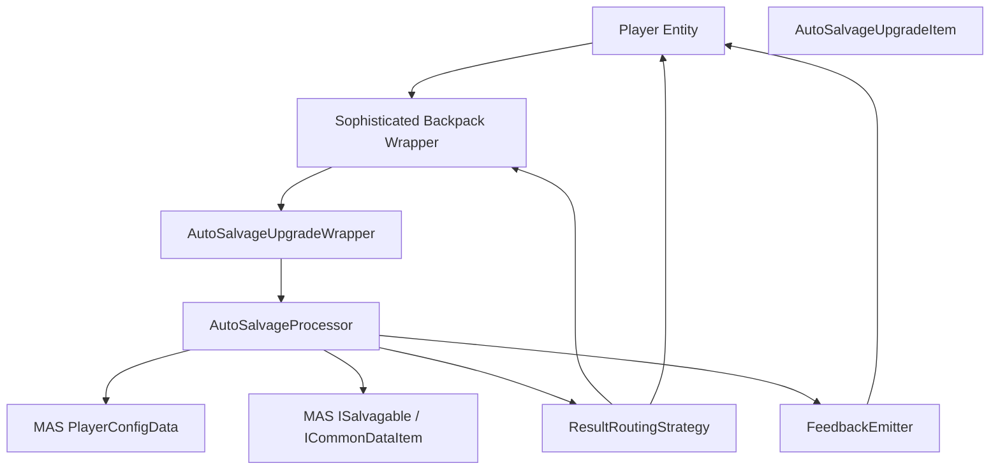
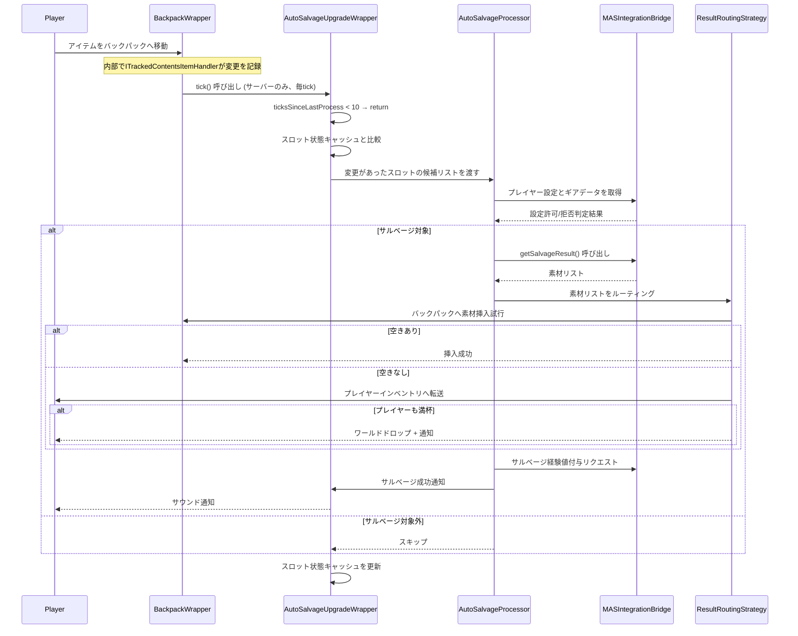
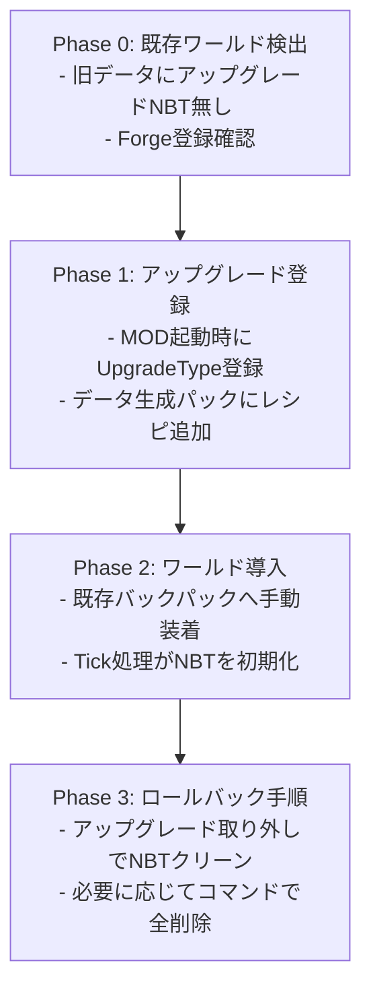

# Design Document

## Overview
Sophisticated MASに追加するAuto Salvageアップグレードは、Sophisticated Backpacksのストレージに投入されたMine and Slash製ギアを、プレイヤーがMine and Slash側で設定した自動サルベージ条件に従って即時に処理し、素材の自動回収と通知を統合する機能である。本設計は、両MOD間のデータモデルとイベントライフサイクルを橋渡しし、既存のバックパック運用に最小限の負荷で組み込む。

**対象ユーザ**: Mine and SlashとSophisticated Backpacksを併用するプレイヤーであり、戦利品整理・素材収集を自動化したい利用者やサルベージ経験値を安定的に得たい層が主となる。

**運用面**: バックパックTick処理とMine and Slash設定参照の整合性を保ち、既存のバックパックUI・設定には影響を与えない。

**導入影響**: バックパック内ギア投入時の追加処理、Mine and Slashの能力データへの読み取りアクセス、Forge登録による新規アップグレード追加に限定され、他機能とのコンフリクトを避けるための優先度管理が必要。

### Goals
- Mine and Slashギアをバックパック内で検出し、プレイヤー設定に従って自動サルベージを実行する。
- サルベージ結果素材を安全に格納し、格納できない場合のフォールバックと通知を提供する。
- アップグレードの有効・無効および装着状態に応じて処理を制御し、動作状況をプレイヤーへ伝える。

### Non-Goals
- Mine and Slash側の自動サルベージ設定UIやロジックの改修。
- Sophisticated Backpacks標準UIへの新規設定画面追加。
- 既存MASバックパックや他アドオンとの連携仕様変更。

## Architecture

### Existing Architecture Analysis
**Sophisticated Backpacksアップグレードシステム**:
- `UpgradeItemBase<W>`/`UpgradeWrapperBase<W, I>`/`UpgradeHandler`による拡張ポイントを提供。
- `ITickableUpgrade`がサーバーTickで呼び出される（`BackpackWrapper.inventoryHandler.tick()`経由）。
- Wrapperは`ITrackedContentsItemHandler`経由でインベントリへアクセスし、必要に応じてNBTへ状態を保存。
- 参照実装: `AutoFeedUpgradeWrapper` (tick処理), `AutoSmeltingUpgradeWrapper` (アイテム変換)

**Mine and Slashサルベージシステム**:
- `Load.player(player).config.salvage`にプレイヤーごとの自動サルベージ設定と判定ロジックを保持。
- `ISalvagable`インターフェースがギア詳細とサルベージ結果を提供。
- `ICommonDataItem`がレア度・タイプ情報を提供し、`PlayerConfigData.AutoSalvage`が設定ベースの判定を実行。
- 結果素材の標準ルートはMASバックパック (`Backpacks.tryAutoPickup`) またはプレイヤーインベントリ。
- 参照実装: `PlayerConfigData.trySalvageOnPickup()` (自動サルベージロジック)

**Sophisticated MAS本体**:
- Kotlinベースで`Registrate`によるビルダーパターン登録を使用。
- 既存コードとは責務が分離されており、新規パッケージ`upgrades.autosalvage`を追加しても依存関係が循環しない。
- `init/`パッケージで登録処理を集約する既存パターン。

### High-Level Architecture


**Architecture Integration**:
- **既存パターン**: `UpgradeWrapperBase`を継承し`ITickableUpgrade`でTick駆動処理を実装。
- **新規コンポーネント**: 処理ロジックを`AutoSalvageProcessor`へ分離し、Wrapperは状態取得と呼び出しに専念。
- **技術整合性**: KotlinからJava APIを呼ぶため、null安全と`Optional`→Kotlin型変換を明示するユーティリティを配置。
- **Steering対応**: upgrade層は`upgrades`配下、防御的な境界と単一責務を守り、設定はForge Configに追加しない。

### Technology Stack and Design Decisions

#### Technology Alignment
- **言語**: Kotlinを主とし、MAS/Java APIとの相互運用で拡張関数と型安全を確保する。
- **登録**: `Registrate` (MC1.20-1.3.3) を使用し、流暢なビルダーパターンでアイテム・言語ファイル・タブを一括登録する。
- **依存**: Forge・MAS・Sophisticated Backpacks・Registrateを使用。Mine and SlashのAPIバージョン互換性を保つため、直接参照するクラスは`gradle`の依存で解決。

#### Key Design Decisions

**Decision 1: Tick処理とSlot変更検出の統合**
- **Context**: バックパック内の全スロットを毎Tick走査するとパフォーマンス劣化が懸念される。
- **Alternatives**:
  1. 毎Tickフルスキャン
  2. `ITrackedContentsItemHandler`の変更通知を直接フック
  3. Tick処理内でキャッシュ比較による差分検出
- **Selected Approach**: Tick処理内でキャッシュ比較による差分検出。前回のスロット状態をWrapper NBTに保存し、変更があったスロットのみ処理。
- **Rationale**: `ITrackedContentsItemHandler`の変更通知は直接フックできないため、Tickベースのポーリングが必要。キャッシュ比較により処理対象を限定し、Tick負荷を最小化。
- **Trade-offs**: NBTにスロット状態を保存するため、ストレージ容量が若干増加。ただし、アイテムIDとカウントのみを保存するため影響は軽微。

**Decision 2: サルベージ結果の格納優先順位**
- **Context**: 要件で結果素材を安全に格納しフォールバックする必要がある。
- **Alternatives**:
  1. MAS標準`Backpacks.tryAutoPickup`を再利用
  2. Sophisticated Backpackのみ使用
  3. プレイヤーのみ収納
- **Selected Approach**: Sophisticated Backpackへまず挿入し、空きがなければプレイヤーへ転送、双方不可ならドロップし通知する。
- **Rationale**: ユーザ期待である「バックパックで完結」を満たす。
- **Trade-offs**: MAS側オートピックアップとは重複せず、新たな結果転送ロジックを実装する必要がある。

**Decision 3: Tick処理の最適化とクールダウン**
- **Context**: 無限Tickで毎回スロットチェックすると過負荷。
- **Alternatives**:
  1. 毎Tick走査
  2. Forge Schedulerを使う
  3. クールダウンをWrapper内部で追跡
- **Selected Approach**: Wrapperに`ticksSinceLastProcess`カウンターを設け、10tick（0.5秒）ごとに処理を実行。
- **Rationale**: Tick負荷を制御し、サーバーパフォーマンスへの影響を最小化。
- **Trade-offs**: サルベージ実行に最大0.5秒の遅延が発生するが、ユーザ体験に影響しない範囲。

## System Flows

### Salvage Processing Sequence


## Requirements Traceability
- **R1 (ギア検出と条件評価)**: `AutoSalvageUpgradeWrapper` (Tick処理), `AutoSalvageProcessor` (判定), `MasIntegrationBridge` (MAS API呼出)で実現。
- **R2 (サルベージ処理と成果物管理)**: `ResultRoutingStrategy` (格納・フォールバック), `MasIntegrationBridge` (経験値付与)で実現。
- **R3 (有効化とプレイヤーフィードバック)**: `AutoSalvageUpgradeWrapper` (有効化状態管理), `FeedbackEmitter` (通知)で実現。

## Components and Interfaces

### Upgrade Layer

#### AutoSalvageUpgradeItem
**Responsibility & Boundaries**
- **Primary Responsibility**: Forge登録されるアイテムとして、バックパックへのアップグレード装着を提供する。
- **Domain Boundary**: Sophisticated Backpacksアップグレードドメイン。
- **Data Ownership**: なし。Wrapperへ委譲。
- **Transaction Boundary**: Forge登録時のみ。

**Dependencies**
- **Inbound**: `ModItems`初期化（Registrate経由）。
- **Outbound**: `UpgradeType<AutoSalvageUpgradeWrapper>`。
- **External**: `Registrate`、Forge。

**Contract Definition**

```kotlin
class AutoSalvageUpgradeItem : UpgradeItemBase<AutoSalvageUpgradeWrapper>(
    Config.SERVER.maxUpgradesPerStorage,
    UpgradeGroup.SMELTING,
    UpgradeType(::AutoSalvageUpgradeWrapper)
) {
    override fun getType(): UpgradeType<AutoSalvageUpgradeWrapper>
    override fun getUpgradeConflicts(): List<UpgradeConflictDefinition>
}
```

**Preconditions**:
- Registrate初期化フェーズで`ModItems.register()`が呼ばれている。

**Postconditions**:
- アップグレードアイテムがクリエイティブタブとレシピで入手可能。
- 言語ファイルが自動生成される。

**Failure Modes**:
- Registrate初期化失敗時はMODロード停止。Registrateシングルトンを`@Mod`クラス初期化時に生成。

---

#### AutoSalvageUpgradeWrapper
**Responsibility & Boundaries**
- **Primary Responsibility**: Tick時にスロット変更を検出し、Processorへ必要情報を渡す。
- **Domain Boundary**: アップグレード実行ロジック。
- **Data Ownership**: NBT内に`ticksSinceLastProcess`, `slotStateCache`, `disabledFlag`。
- **Transaction Boundary**: Tick開始から処理終了まで。

**Dependencies**
- **Inbound**: `BackpackWrapper` (tick呼出)、`AutoSalvageUpgradeItem`。
- **Outbound**: `AutoSalvageProcessor`, `FeedbackEmitter`。
- **External**: MAS API (`Load`, `ISalvagable`, `ICommonDataItem`)、SophisticatedCore (`ITrackedContentsItemHandler`)。

**Contract Definition**

```kotlin
class AutoSalvageUpgradeWrapper(
    storageWrapper: IStorageWrapper,
    upgrade: ItemStack,
    upgradeSaveHandler: Consumer<ItemStack>
) : UpgradeWrapperBase<AutoSalvageUpgradeWrapper, AutoSalvageUpgradeItem>(
    storageWrapper, upgrade, upgradeSaveHandler
), ITickableUpgrade {

    private var ticksSinceLastProcess: Int = 0
    private val slotStateCache: MutableMap<Int, ItemStackSnapshot> = mutableMapOf()

    override fun tick(entity: Entity?, level: Level, pos: BlockPos)
    fun persistState(tag: CompoundTag)
    fun loadState(tag: CompoundTag)
    fun setEnabled(enabled: Boolean)
    fun isEnabled(): Boolean
}

data class ItemStackSnapshot(
    val item: Item,
    val count: Int,
    val tag: CompoundTag?
)
```

**Preconditions**:
- `entity`が`Player`インスタンス。
- `level.isClientSide`が`false`（サーバー側のみ実行）。
- `entity`が`null`または`Player`以外（バックパックブロック経由など）の場合は後続処理へ進まない。

**Postconditions**:
- スロット変更があった場合、`AutoSalvageProcessor`が呼ばれ、結果が反映される。
- スロット状態キャッシュが更新される。

**Invariants**:
- `ticksSinceLastProcess`は0～9の範囲内。

**Failure Modes**:
- Entityが`Player`でない場合 → 即return。
- Client側Tick → 無視。
- MAS API例外 → ログ出力と処理スキップ。
- バックパックブロック設置状態でのサルベージ要求 → `entity`が`Player`でないため即returnし、経験値付与・通知も発生しない（非対応ケースとして許容）。

---

#### AutoSalvageProcessor
**Responsibility & Boundaries**
- **Primary Responsibility**: スロット候補ごとにMAS設定判定を行い、サルベージ結果生成・経験値付与・結果ルーティングを行う。
- **Domain Boundary**: ビジネスロジック。
- **Data Ownership**: 処理中のみの`SalvageCandidate`, `SalvageResult`。
- **Transaction Boundary**: 単一Tickでの候補処理。

**Dependencies**
- **Inbound**: `AutoSalvageUpgradeWrapper`。
- **Outbound**: `MasIntegrationBridge`, `ResultRoutingStrategy`, `FeedbackEmitter`。
- **External**: Mine and Slash API。

**Contract Definition**

```kotlin
object AutoSalvageProcessor {
    fun processCandidates(
        player: Player,
        candidates: List<SalvageCandidate>,
        storage: ITrackedContentsItemHandler
    ): ProcessingResult

    private fun shouldSalvage(
        player: Player,
        candidate: SalvageCandidate
    ): Boolean
}

data class SalvageCandidate(
    val slotIndex: Int,
    val stack: ItemStack
)

data class ProcessingResult(
    val salvaged: List<SalvageOutcome>,
    val skipped: List<SalvageCandidate>
)

data class SalvageOutcome(
    val originalSlot: Int,
    val materials: List<ItemStack>,
    val experience: Int
)
```

**Preconditions**:
- `candidates`が空でないリスト。
- `player`が有効な`Player`インスタンス。

**Postconditions**:
- サルベージ対象のアイテムが削除され、素材が格納される。
- プレイヤーに経験値が付与される。

**Failure Modes**:
- Salvage結果が空 → 処理スキップ。
- Configが未初期化 → falseを返却して保持。

---

#### MasIntegrationBridge
**Responsibility & Boundaries**
- **Primary Responsibility**: Mine and Slash側のプレイヤー設定・サルベージAPI呼出しを型安全に包む。
- **Domain Boundary**: 外部統合レイヤー。
- **Data Ownership**: なし。
- **Transaction Boundary**: 各呼出し毎。

**Dependencies**
- **Inbound**: `AutoSalvageProcessor`。
- **Outbound**: `Load.player`, `PlayerConfigData.AutoSalvage`, `ISalvagable.load`。
- **External**: Mine and Slash。

**Contract Definition**

```kotlin
object MasIntegrationBridge {
    fun readAutoSalvageConfig(player: Player): AutoSalvageConfig?
    fun fetchSalvagableData(stack: ItemStack): SalvagableData?
    fun getSalvageResults(stack: ItemStack, data: SalvagableData): List<ItemStack>
    fun grantSalvageExperience(player: Player, data: SalvagableData, amount: Int)
}

data class AutoSalvageConfig(
    val enabledTypes: Set<String>,
    val enabledRarities: Set<String>
)

data class SalvagableData(
    val salvageType: String,
    val salvageConfigId: String,
    val rarityId: String,
    val expReward: Int
)
```

**Preconditions**:
- `player`が有効で、MAS capabilityが解決可能。

**Postconditions**:
- MASのデータが型安全な形で返却される。

**Failure Modes**:
- Capabilityが未解決 → `null`を返し、Processor側でフォールバック。

---

#### ResultRoutingStrategy
**Responsibility & Boundaries**
- **Primary Responsibility**: サルベージ素材格納順序・分配を担う。
- **Domain Boundary**: 在庫管理。
- **Data Ownership**: なし。
- **Transaction Boundary**: 単一結果リスト。

**Dependencies**
- **Inbound**: `AutoSalvageProcessor`。
- **Outbound**: `ITrackedContentsItemHandler`, Player Inventory。
- **External**: Forge `ItemHandlerHelper`。

**Contract Definition**

```kotlin
object ResultRoutingStrategy {
    fun route(
        materials: List<ItemStack>,
        storage: ITrackedContentsItemHandler,
        player: Player
    ): RoutingOutcome
}

data class RoutingOutcome(
    val storedInBackpack: Int,
    val sentToPlayer: Int,
    val dropped: Int,
    val failureReason: String?
)
```

**Preconditions**:
- `materials`が空でないリスト。

**Postconditions**:
- 素材が可能な限りバックパック→プレイヤー→ワールドドロップの順で格納される。

**Failure Modes**:
- すべての挿入が失敗 → 失敗理由を返却し`FeedbackEmitter`へ通知させる。

---

#### FeedbackEmitter
**Responsibility & Boundaries**
- **Primary Responsibility**: サルベージ成功・失敗・停止を可視化（サウンド、ステータスメッセージ）。
- **Domain Boundary**: UX層。
- **Data Ownership**: なし。

**Dependencies**
- **Inbound**: `AutoSalvageProcessor`/`AutoSalvageUpgradeWrapper`。
- **Outbound**: Forge `SoundSource`, `Component`。

**Contract Definition**

```kotlin
object FeedbackEmitter {
    fun notifySuccess(player: Player, count: Int)
    fun notifyFailure(player: Player, reason: FailureReason)
}

enum class FailureReason {
    STORAGE_FULL,
    MAS_CONFIG_ERROR,
    INVALID_ITEM
}
```

**Preconditions**:
- `player`が有効なサーバー側`Player`インスタンス。

**Postconditions**:
- プレイヤーにサウンドまたはメッセージが送信される。

**Failure Modes**:
- クライアント側判定 → サーバー側でのみ実行し、クライアント通知は`Player`オブジェクト経由で自動送信。

### Registration Layer

#### ModRegistrate
**Responsibility & Boundaries**
- **Primary Responsibility**: `Registrate`を初期化し、Auto Salvageアップグレードアイテムを流暢なビルダーパターンで登録する。
- **Domain Boundary**: 初期化。
- **Data Ownership**: `Registrate`シングルトン。

**Dependencies**
- **Inbound**: `SophisticatedMAS`メインクラス初期化。
- **Outbound**: Forge登録バス、Registrate。

**Contract Definition**

```kotlin
object ModRegistrate {
    val REGISTRATE: Registrate = Registrate.create(SophisticatedMAS.MOD_ID)

    val AUTO_SALVAGE_UPGRADE: ItemEntry<AutoSalvageUpgradeItem> = REGISTRATE
        .item("auto_salvage_upgrade", ::AutoSalvageUpgradeItem)
        .lang("Auto Salvage Upgrade")
        .register()

    fun register() {
        // Registrateの登録はビルダーチェーン内で自動実行される
    }
}
```

**Preconditions**:
- `SophisticatedMAS.MOD_ID`が定義済み。
- `Registrate`依存がビルドパスに存在。

**Postconditions**:
- アップグレードアイテムがForgeレジストリに登録される。
- 英語言語ファイルが自動生成される。

**Failure Modes**:
- Registrate初期化失敗 → ビルドフェーズで検出、クラスロード時例外。

## Data Models

### Domain Model
- **SalvageCandidate**: スロットインデックスとアイテムスタックを保持。
- **SalvageOutcome**: サルベージ結果（素材リスト、経験値）を保持。
- **ItemStackSnapshot**: スロット状態キャッシュ用の軽量アイテム表現（Item型、カウント、NBT）。

### Logical Data Model
**Upgrade NBT** (`upgrade.tag`):
- `smas_ticksSinceLastProcess` (Int): 最後の処理からのTick数。
- `smas_slotStateCache` (CompoundTag): スロットインデックス→ItemStackSnapshotのマップ。
- `smas_disabled` (Boolean): アップグレード無効化フラグ。

**ItemStackSnapshot NBT**:
- `item` (String): アイテムレジストリID。
- `count` (Int): スタックサイズ。
- `tag` (CompoundTag, optional): アイテムNBT。

### Data Contracts & Integration
**MAS Integration**:
- `PlayerConfigData.AutoSalvage.checkTypeSalvageConfig(type: String, id: String): Optional<Boolean>`
- `PlayerConfigData.AutoSalvage.checkRaritySalvageConfig(type: String, rarity: String): Boolean`
- `ICommonDataItem.load(stack: ItemStack): ICommonDataItem<*>?`
- `ISalvagable.getSalvageResult(exileStack: ExileStack): List<ItemStack>`

**Sophisticated Backpacks**:
- `ITrackedContentsItemHandler.getStackInSlot(slot: Int): ItemStack`
- `ITrackedContentsItemHandler.insertItem(slot: Int, stack: ItemStack, simulate: Boolean): ItemStack`
- `ITrackedContentsItemHandler.extractItem(slot: Int, amount: Int, simulate: Boolean): ItemStack`

**Registrate**:
- `Registrate.item(name: String, factory: Function<Item.Properties, T>): ItemBuilder<T, Registrate>`
- `ItemBuilder.lang(name: String): ItemBuilder<T, P>`
- `ItemBuilder.register(): ItemEntry<T>`

## Error Handling

### Error Strategy
- スロット状態取得不能時はエラーログを出力し、該当スロットをスキップ。
- MAS API呼出しで例外が発生した場合は該当スタックのみスキップし、バックパックへ残す。
- 結果格納失敗・ドロップ時は`FeedbackEmitter`が詳細理由（バックパック満杯等）をプレイヤーへ通知。

### Error Categories and Responses
- **User Errors**: アップグレード無効化 → チャットメッセージで「アップグレードが無効」通知。
- **System Errors**: Capability未解決 → ロガーで`WARN`、再試行は次Tick。
- **Business Logic Errors**: サルベージ禁止状態 → 処理結果に「禁止」ステータスを付与し通知のみ。

### Monitoring
- `LOGGER`へカテゴリ別ログ（TRACE:処理候補数, INFO:サルベージ件数, WARN:失敗理由）を出力。
- デバッグモード（システムプロパティ）で詳細ログを有効化。

## Testing Strategy

**Unit Tests**:
1. `AutoSalvageProcessor.shouldSalvage`のMAS設定別判定テスト（レア度別、タイプ別）。
2. `ResultRoutingStrategy.route`の空きスロット分配テスト（満杯、部分空き、完全空き）。
3. NBTシリアライズ/デシリアライズテスト（`ItemStackSnapshot`、`slotStateCache`）。

**Integration Tests**:
1. モックバックパックインスタンスに対するTick駆動サルベージテスト。
2. MAS模擬データを使った経験値付与検証。
3. スロット状態変更からの候補生成テスト。

**E2E Tests**:
1. プレイヤー装備バックパックでのフィールドテストシナリオ（実ギア投入）。
2. バックパック満杯状態の失敗通知確認。

**Performance Tests**:
1. 500スタック投入を想定したTick処理時間計測。
2. 連続サルベージによるGC影響観測。

## Security Considerations
- プレイヤーデータCapabilityへの読み取りのみで書込みを行わないため、データ汚染リスクは低い。
- Cross-mod通信は同一JVM内で完結し、追加のネットワーク通信は不要。
- ドロップ処理はサーバー権限で実行し、クライアント改ざんの影響を避ける。

## Performance & Scalability
- Tick処理はキャッシュ比較ベース＋クールダウン（10Tick）で制御し、大量アイテム投入でも1Tickあたり最大10候補へ制限。
- サルベージ結果が大量になるケースではバッチ分割して複数Tickへ伸ばし、1TickのI/Oを抑制。
- `ITrackedContentsItemHandler`への頻繁な`insertItem`呼出しは`simulate=true`→`実行`の二段階で最小化。

## Migration Strategy


**Backward Compatibility**:
- アップグレード未装着時は一切処理しない。
- NBTキーは固有prefix `smas_`を使用し、将来の互換を確保。

**Validation**:
- 初回起動時にForge登録が成功したかログで確認。
- データ生成ツールでクラフトレシピを検証。

**Rollback**:
- アップグレードアイテムを解除すればNBTがクリアされる設計。
- 必要に応じて`/data remove entity @e[type=item] Item.tag.smas_*`で全削除が可能。
