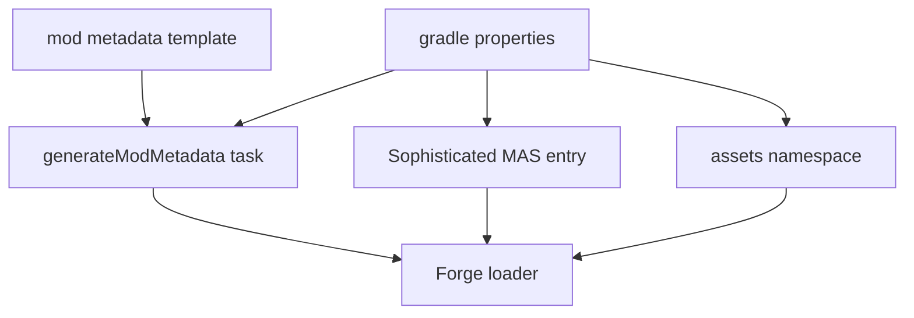
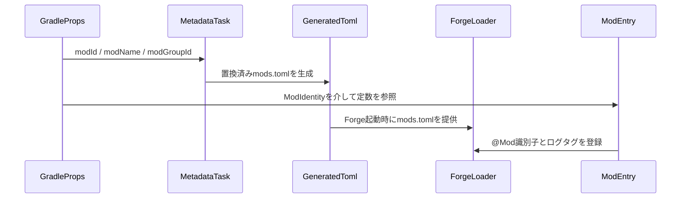
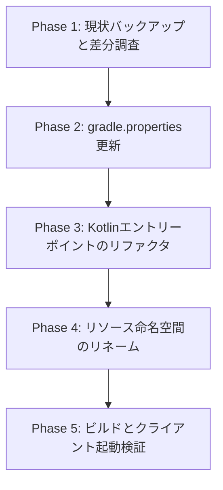

# Design Document

## Overview

Sophisticated
MASはテンプレートMODから派生した結果、ビルド定義・エントリーポイント・アセット階層に旧識別子（examplemod）が混在しており、Forge読み込み時に警告や公開チャンネルでの誤表記を招くリスクがある。本設計はMOD
IDと表示名を「sophisticatedmas」「Sophisticated MAS」に統一し、ビルドから実行時まで一貫性を確保する手順を定義する。
リリース担当と開発者が共通の識別情報を扱えるようにすることで、自動配布パイプラインや依存MODからの参照におけるメンテナンスコストを削減する。生成タスクやフォルダー構成を整理することで、今後の機能追加時にも同一の名前空間を前提に設計できる土台を提供する。
**Purpose**: MOD識別子を単一の情報源で維持し、Forgeおよび配布チャネルの表示を正確化する。
**Users**: Sophisticated MAS開発者、ビルド担当、配布担当が統一設定を利用する。
**Impact**: 既存テンプレート識別子を除去し、build/run環境・公開メタデータ・リソース参照が最新名に揃う。

### Goals

- gradle.propertiesとmods.tomlテンプレートを単一のMOD ID/名称へ更新し、関連タスクから再利用できる状態にする。
- Forgeエントリーポイントを`io.github.cotrin8672.sophisticatedmns`配下へ移し、新しい定数を参照させる。
- `assets/`配下を`sophisticatedmas`名前空間へリネームし、翻訳キーおよびデータ生成出力の整合を担保する。
- 公開設定（ModPublisher含む）の表示名と成果物ファイル名が新識別子で生成されることを確認する。

### Non-Goals

- Mine and SlashやSophisticated Backpacksの機能実装・バランス調整は対象外。
- 自動ビルドのCI/CD定義変更は範囲外（必要になれば別仕様で扱う）。
- 新規アイテムやGUI追加など、MOD機能領域の拡張は本フェーズでは行わない。
- 翻訳テキストの内容刷新や追加ロケール対応は後続フェーズに委ねる。

## Architecture

### Existing Architecture Analysis

- gradle.propertiesがmodId/modName/modGroupIdなどのテンプレート値を保持し、ProcessResources派生の`generateModMetadata`
  タスクがmods.tomlを生成している。
- Kotlinエントリーポイントは`io.github.cotrin8672.examplemod.ExampleMod`で、ID定数`examplemod`をForgeへ提供している。
- リソース階層は`assets/examplemod/lang/en_us.json`のみが存在し、翻訳キーも旧IDでプレフィックスされている。
- ModPublisher設定はgradleプロパティを参照するため、modName/modId変更が成果物命名と公開設定に直接影響する。

### High-Level Architecture

ビルド定義、生成タスク、ランタイム初期化、リソース参照を一連の情報源（ModIdentityConfig）で連結する構成へ移行する。



**Architecture Integration**:

- Existing patterns preserved: Kotlin for Forgeによる`@Mod`シングルトン、Gradle ProcessResources、DeferredRegister構成。
- New components rationale: ModIdentityConfig（定数集約）とResourceNamespaceBundle（命名規約定義）で、識別子の重複定義を排除する。
- Technology alignment: Kotlin・Gradle・Forgeの既存スタックのみを利用し、新規依存を追加しない。
- Steering compliance: 構造ガイドラインで定義済みの`init/`および`resources/assets/{modId}`パターンに合わせる。

## Technology Alignment

- Kotlin for Forge 4.11.0で提供される`@Mod`エントリーパターンを踏襲し、オブジェクト宣言と定数による型安全な識別子管理を行う。
- ModDevGradle LegacyForgeのProcessResources拡張（generateModMetadata）をそのまま活用し、プロパティ置換によりmods.tomlを生成する。
- ModPublisher設定は`modId`と`modName`に依存しているため、gradle.propertiesのみを単一情報源とし、別ファイルでの重複直書きを避ける。
- 新規ライブラリは導入せず、既存依存関係の範囲内で変更を完結させる。

## Key Design Decisions

1. **Decision**: ModIdentityConfigオブジェクトを導入し、MOD ID・名称・ログタグを一元管理する。
    - **Context**: KotlinコードとGradleプロパティの双方で識別子が散在していると、将来の変更時に同期漏れが発生する。
    - **Alternatives**: 各所で文字列リテラルを直接更新する／Enumを導入する／外部設定ファイルを読み込む。
    - **Selected Approach**: Kotlinの`object ModIdentity`に`const val MOD_ID`などを定義し、エントリーポイントやLogger初期化がそれを参照する。
    - **Rationale**: 追加クラス不要で軽量、型安全、IDEリファクタリングが効く。
    - **Trade-offs**: `ModIdentity`を経由しない直接参照が残る可能性があるためレビューと静的解析で管理が必要。
2. **Decision**: gradle.propertiesを唯一のビルド時情報源とし、mods.tomlテンプレートやModPublisherへは置換で反映させる。
    - **Context**: テンプレート側に定数を書き込むとGradleプロパティと乖離しやすい。
    - **Alternatives**: mods.tomlを直書きする／別JSON設定から読み込む。
    - **Selected Approach**: 既存のテンプレート構造を維持しつつ、プロパティ値を最新化するのみ。
    - **Rationale**: ビルドパイプライン改修が不要で、安全に差し替え可能。
    - **Trade-offs**: プロパティ値を更新する際にCI側の参照（例: publishing設定）も併せて確認する必要がある。
3. **Decision**: リソース階層を物理的に`sophisticatedmas`へリネームし、翻訳キーも同一プレフィックスへ変更する。
    - **Context**: Forgeはリソースローダーでディレクトリ名をネームスペースとして解釈するため、旧ディレクトリではアイテム登録時に齟齬が出る。
    - **Alternatives**: DataGeneratorで出力するまで旧ディレクトリを保持／ロード時にエイリアスを張る。
    - **Selected Approach**: ディレクトリとキーを即時リネームし、参照側も一括更新する。
    - **Rationale**: 最小限の変更で意図通りのネームスペースが保証される。
    - **Trade-offs**: 既存リソース差分が多い場合はリネームによるレビュー負荷が増えるが、現状ファイル数が少ないため影響軽微。

## System Flows

識別子がForge初期化へ伝播するまでの流れを下記に示す。



## Requirements Traceability

- **Requirement 1.x**: ModIdentityConfigとMetadataGenerationTaskでmodId/modNameを単一情報源化し、ModPublisher経由で公開メタデータへ伝播。
- **Requirement 2.x**: SophisticatedMASModEntryが新パッケージへ移行し、DeferredRegisterやLogger初期化でModIdentityを参照。
- **Requirement 3.x**: ResourceNamespaceBundleがassetsディレクトリと翻訳キーの命名規約を定義し、Data
  Generator実行時も同一名前空間を維持。

## Components and Interfaces

### Configuration Layer

#### ModIdentityConfig

**Responsibility & Boundaries**

- **Primary Responsibility**: MOD ID・名称・ログタグなど識別子を単一点で提供する。
- **Domain Boundary**: 共通設定ドメイン（`io.github.cotrin8672.sophisticatedmns`ルート）。
- **Data Ownership**: `MOD_ID`, `MOD_NAME`, `LOGGER_NAME`などの不変値。
- **Transaction Boundary**: 不可変データの提供のみでトランザクション境界は存在しない。
  **Dependencies**
- **Inbound**: SophisticatedMASModEntry、DeferredRegister初期化、ResourceNamespaceBundle。
- **Outbound**: なし（定数提供のみ）。
- **External**: なし。
  **Contract Definition**

```kotlin
object ModIdentity {
    const val MOD_ID: String = "sophisticatedmas"
    const val MOD_NAME: String = "Sophisticated MAS"
    const val LOGGER_NAME: String = "SophisticatedMAS"
}
```

- **Preconditions**: gradle.propertiesのmodId/modNameと同一値であること。
- **Postconditions**: 参照側は直値ではなくModIdentityを介してアクセスする。
- **Invariants**: MOD_IDはForgeの命名規則（小文字英数字とアンダースコア）を満たす。
  **Integration Strategy**
- **Modification Approach**: 新規ファイル（例: `init/ModIdentity.kt`）を追加し、既存エントリーポイントから参照する。
- **Backward Compatibility**: 旧ExampleMod参照を全てModIdentity経由へ置き換え、同名定数を削除。
- **Migration Path**: ModIdentity追加→ExampleMod参照を置換→旧定数を除去。

#### MetadataGenerationTask

**Responsibility & Boundaries**

- **Primary Responsibility**: `generateModMetadata`タスクでmods.tomlへ最新プロパティを反映する。
- **Domain Boundary**: ビルドパイプライン（Gradle）。
- **Data Ownership**: 生成物`build/generated/sources/modMetadata/META-INF/mods.toml`。
- **Transaction Boundary**: タスク実行単位で一貫性を保証。
  **Dependencies**
- **Inbound**: Gradle build lifecycle、publishタスク。
- **Outbound**: Forge loader（mods.toml参照）、ResourceNamespaceBundle（ネームスペース検証時に利用）。
- **External**: ModDevGradle LegacyForge。
  **Batch/Job Contract**
- **Trigger**: `gradlew build`、`runClient`、`runData`の前処理。
- **Input**: gradle.properties（modId, modName, modDescription など）。
- **Output**: 置換済みmods.toml、必要に応じてModPublisherへ設定反映。
- **Idempotency**: 同一プロパティで再実行しても生成結果が変化しない。
- **Recovery**: プロパティが不整合の場合はGradleが失敗するため、ログで該当キーを確認し修正。
  **Integration Strategy**
- **Modification Approach**: gradle.propertiesの値を更新し、テンプレート`src/main/templates/META-INF/mods.toml`
  は変数参照のまま維持。
- **Backward Compatibility**: テンプレート構造は変更しないため、他タスクへの影響は無し。
- **Migration Path**: プロパティ更新→`generateModMetadata`実行→生成物の差分確認。

### Runtime Layer

#### SophisticatedMASModEntry

**Responsibility & Boundaries**

- **Primary Responsibility**: Forge起動時にMODを登録し、ModIdentity定数をExposeする。
- **Domain Boundary**: 初期化ドメイン（`init`パッケージ）。
- **Data Ownership**: Forgeへ提供する`@Mod`識別子。
- **Transaction Boundary**: 初期化イベント単位。
  **Dependencies**
- **Inbound**: Forge loader、MetadataGenerationTask（mods.toml確認）。
- **Outbound**: ModIdentityConfig、将来各種DeferredRegister。
- **External**: Forge API（`net.minecraftforge.fml.common.Mod`）。
  **Contract Definition**

```kotlin
@Mod(ModIdentity.MOD_ID)
object SophisticatedMASMod {
    init {
        // 初期化ロジックをModIdentity基準で構成
    }
}
```

- **Preconditions**: ModIdentity.MOD_IDがmods.tomlのmodIdと一致する。
- **Postconditions**: ForgeのModListに`sophisticatedmas`が登録される。
- **Invariants**: ロガー含む他箇所もModIdentityを参照し名前の二重定義を作らない。
  **Integration Strategy**
- **Modification Approach**: `ExampleMod.kt`を`SophisticatedMASMod.kt`へリネームし、パッケージを
  `io.github.cotrin8672.sophisticatedmns`へ移動。
- **Backward Compatibility**: 旧クラス名を削除しても外部公開APIは無いため影響なし。
- **Migration Path**: ファイル移動→アノテーション更新→ビルド実行でForge登録を確認。

### Asset Layer

#### ResourceNamespaceBundle

**Responsibility & Boundaries**

- **Primary Responsibility**: 言語ファイル・テクスチャ等のリソースを`sophisticatedmas`ネームスペースで提供する。
- **Domain Boundary**: リソースパッケージ（`src/main/resources/assets`）。
- **Data Ownership**: 翻訳キー、テクスチャパス、langファイルなど。
- **Transaction Boundary**: リソース読み込みとDataGenerator出力単位。
  **Dependencies**
- **Inbound**: Data Generator、Minecraftのリソースローダー。
- **Outbound**: Forge loader、将来のレシピ/モデルリソース。
- **External**: なし。
  **Contract Definition**
- **Namespace Rule**: `assets/sophisticatedmas/**` 配下のみ使用する。
- **Translation Keys**: `itemGroup.sophisticatedmas.*`、`item.sophisticatedmas.*`形式で定義。
- **Data Pack Keys**: `data/sophisticatedmas/**` を将来のデータ生成に予約。
- **Validation**: DataGenerator実行時に旧ネームスペースが残存しないことを静的に確認（grepまたはCIスクリプト）。
  **Integration Strategy**
- **Modification Approach**: ディレクトリリネームとlangファイル内のキー置換。
- **Backward Compatibility**: 旧ディレクトリは削除し、参照コードを更新。
- **Migration Path**: 物理リネーム→キー置換→`runData`で整合確認。

## Error Handling

### Error Strategy

- 生成タスクで不一致が発生した場合はGradleが失敗するため、エラーメッセージを根拠にプロパティを修正する。
- Forge初期化時にmods.tomlと`@Mod`のIDが異なると起動時例外になるため、起動前に単体テスト/静的検証（`check`タスク）で整合を確認する。
- リソースネームスペース不一致はMissingResource警告としてログ出力されるため、Logger名をModIdentityで統一し特定しやすくする。

### Error Categories and Responses

- **User Errors**: 手動でgradle.propertiesを書き換える際のタイプミス。→`./gradlew generateModMetadata`
  で検出し、エラーログに修正例を記載する。
- **System Errors**: Forge起動時にmods.toml読み込み失敗。→ビルド時にmods.toml生成可否をCIでチェック、失敗時はビルドを中断する。
- **Business Logic Errors**: ネームスペース不整合でリソース参照が失敗。→DataGeneratorで検証し、翻訳キー整合を自動テスト化する。

### Monitoring

- Forge起動ログに`sophisticatedmas`名前空間で登録された旨をINFOレベルで出力する（ModIdentity.LOGGER_NAMEを利用）。
- ビルドパイプラインでは`generateModMetadata`の出力パスをアーティファクトに含め、CIで差分通知する。

## Testing Strategy

- **Unit Tests**: ModIdentity定数の整合チェック、ResourceNamespaceBundleのキー生成ヘルパ（必要ならユーティリティとして実装）、mods.toml置換ロジックのプロパティ検証。
- **Integration Tests**: `./gradlew runData`が`sophisticatedmas`ネームスペースの出力のみを生成すること、
  `generateModMetadata`結果がMOD IDを正しく反映すること、`./gradlew runClient`でForge ModListにSophisticated MASが表示されること。
- **E2E/UI Tests**: 手動検証としてクライアント起動後のMOD一覧スクリーンショット取得を推奨。自動化は後続フェーズ。
- **Performance/Load**: 本変更はビルド時処理のみでパフォーマンス影響が軽微なため、追加計測は不要。

## Migration Strategy

段階的に識別子を移行し、各フェーズ後にビルド確認を行う。



- 各フェーズ完了後に`git status`で差分を確認し、問題発生時は直前フェーズへロールバックする。
- Phase5で`./gradlew build`と`./gradlew runClient`を実行し、mods.tomlとMOD一覧の表示をもって移行完了とする。
